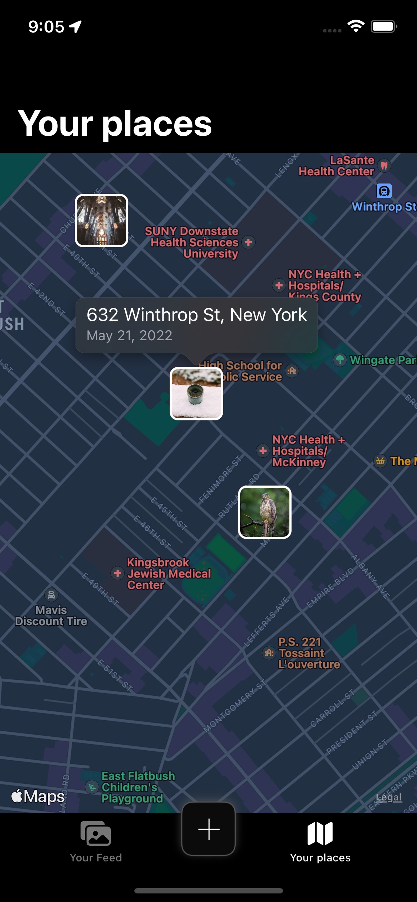

#  Phlog

Phlog is a simple photo blogging app written in Swift where users can add a photo from the library and some text to it.

I am making it solely for practice with different patterns and frameworks.
I don't use any 3rd party dependencies.

## The current state

The app is designed around *MVVM-C*. 
Frameworks and stuff:
 - UIKit
 - Collection View and Diffable Data Source
 - Core Data and NSFetchedResultController
 - Photos (PHImageManager) and PhotosUI (PHPickerViewController) 
 

